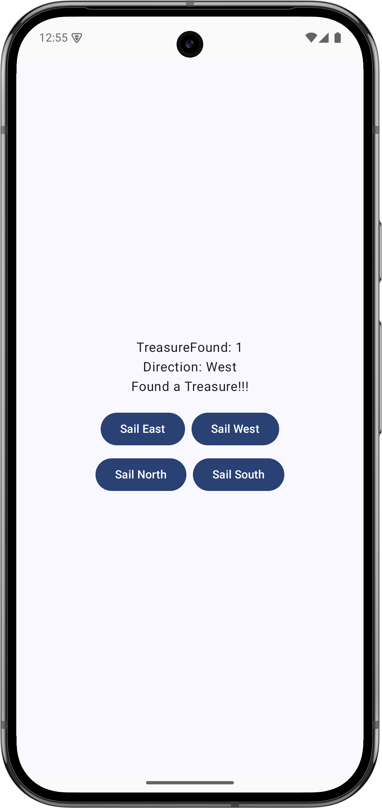
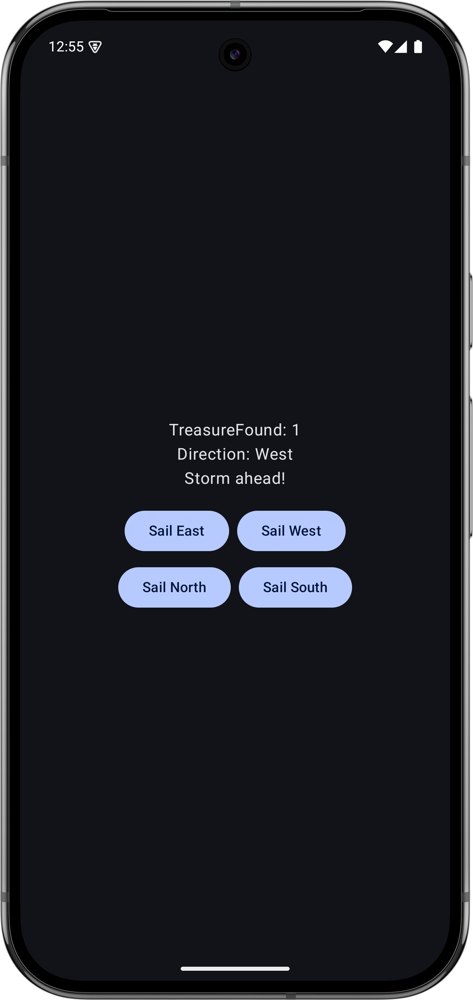
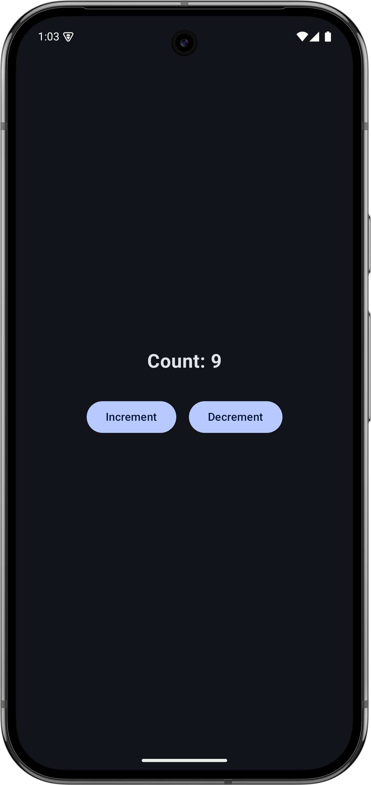
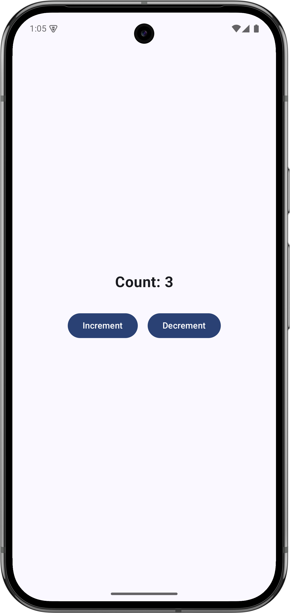
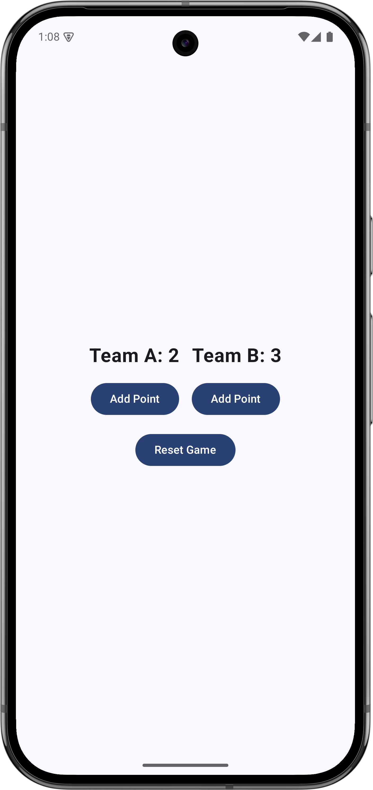
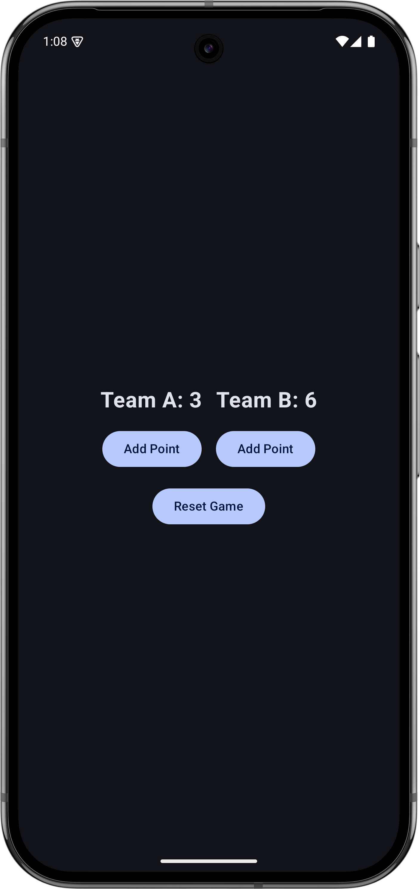
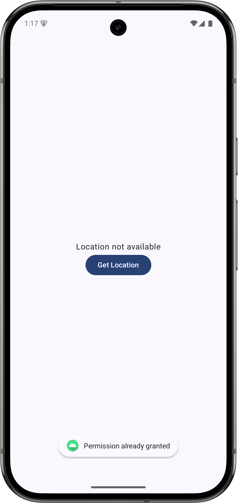
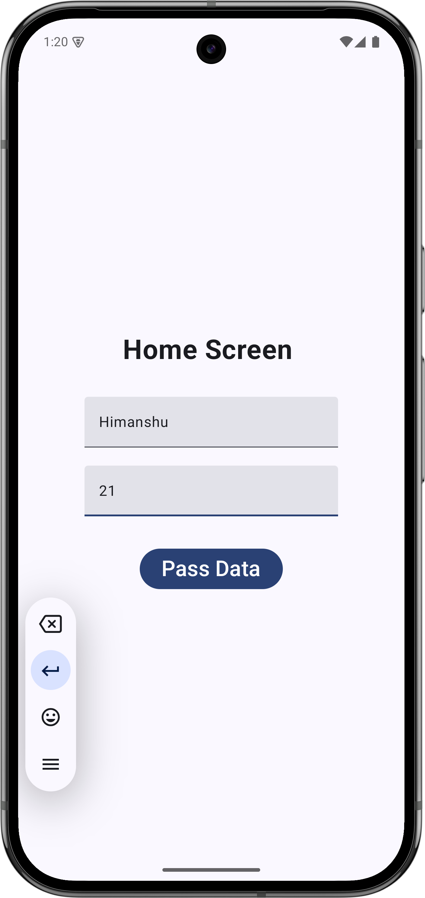
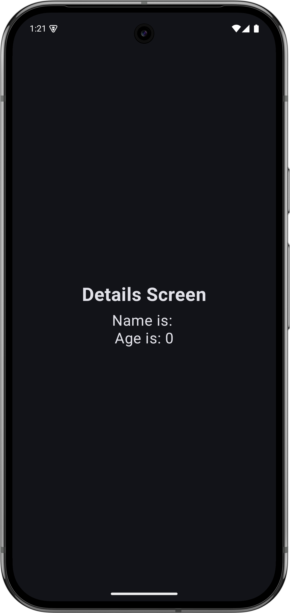

# Android Fundamentals 🚀

Welcome to the **Android Fundamentals** repository! This project is a comprehensive collection of Android applications developed to master the core concepts of modern Android development using **Jetpack Compose**, **MVVM Architecture**, **State Management**, and **Navigation**.

[](https://github.com/rathee-dev/Android-Fundamentals)
[](https://github.com/rathee-dev/Android-Fundamentals)
[](LICENSE)

---

## 📱 Project Overview

This repository contains several mini-projects, each focusing on a specific aspect of Android development.

### 1. Unit Converter App 📏
A handy tool for converting between various units. It demonstrates the use of `mutableStateOf`, `remember`, and custom UI components in Jetpack Compose.
- **Key Features:** Real-time conversion, dropdown menus, and a clean UI.
- **Screenshot:**
  

### 2. Captain Game 🏴‍☠️
An interactive game where you take the role of a captain sailing the high seas.
- **Key Features:** State management, random event generation (treasures and storms).
- **Screenshots:**
  | Screenshot 1 | Screenshot 2 |
  |--------------|--------------|
  |  |  |

### 3. Counter MVVM 🔢
A classic counter application built using the **Model-View-ViewModel (MVVM)** design pattern.
- **Key Features:** Separation of concerns, use of `ViewModel` and `LiveData`/`State`.
- **Screenshots:**
  | Screenshot 1 | Screenshot 2 |
  |--------------|--------------|
  |  |  |

### 4. Game Score Keeper 🏀
A simple app to keep track of scores during a game.
- **Key Features:** MVVM architecture, persistent state during configuration changes.
- **Screenshots:**
  | Screenshot 1 | Screenshot 2 |
  |--------------|--------------|
  |  |  |

### 5. Location App 📍
Demonstrates how to access and display the user's current location.
- **Key Features:** Permission handling, Fused Location Provider.
- **Screenshot:**
  

### 6. Navigation Test 🧭
Explores the Jetpack Compose Navigation component to move between different screens.
- **Key Features:** NavHost, NavController, and passing arguments between screens.
- **Screenshots:**
  | Screenshot 1 | Screenshot 2 |
  |--------------|--------------|
  |  |  |

---

## 🛠️ Tech Stack

- **Language:** [Kotlin](https://kotlinlang.org/)
- **UI Framework:** [Jetpack Compose](https://developer.android.com/jetpack/compose)
- **Architecture:** MVVM (Model-View-ViewModel)
- **Navigation:** Jetpack Compose Navigation
- **State Management:** `remember`, `mutableStateOf`, `ViewModel`

---

## 🚀 Getting Started

To run these projects locally:

1. Clone the repository:
   ```bash
   git clone https://github.com/rathee-dev/Android-Fundamentals.git
   ```
2. Open the desired project folder in **Android Studio**.
3. Build and run on an emulator or a physical device.

---

## 👤 Author

**Rathee Dev**
- GitHub: [@rathee-dev](https://github.com/rathee-dev)

---

## 📄 License

This project is licensed under the MIT License - see the [LICENSE](LICENSE) file for details.

---

⭐ If you find this repository helpful, please consider giving it a star!
